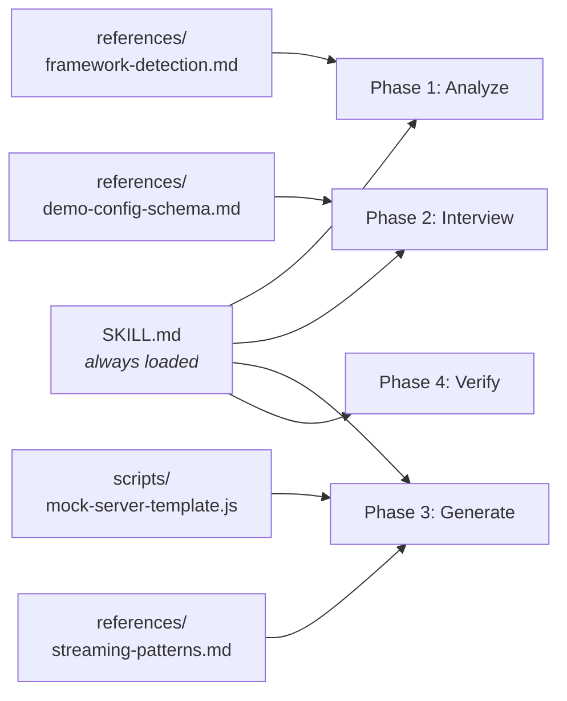
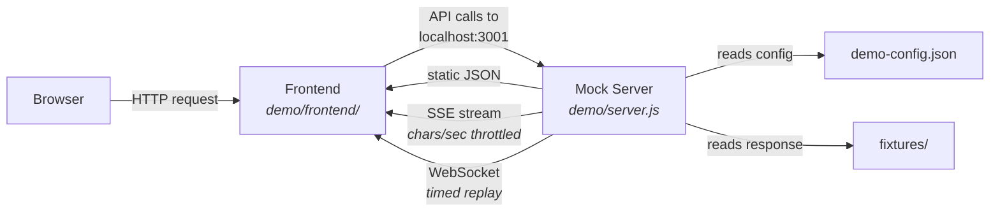

# CLAUDE.md

This file provides guidance to Claude Code (claude.ai/code) when working with code in this repository.

## What This Is

A Claude Code skill (`frontend-demo`) that generates standalone demo environments for hackathon projects. It creates a `demo/` folder with a mock Express server that replays pre-baked API responses (including realistic LLM streaming) so demos run flawlessly without real API calls.

## Repository Structure

This is a **documentation-driven skill** — no build step, no compilation. The skill uses progressive disclosure, loading reference files only when their phase is reached:

- `evals/evals.json` — 3 test cases (Next.js+OpenAI, Vue+REST, SvelteKit+Anthropic+WebSocket)

## Generated Demo Runtime

How the generated `demo/` folder works at runtime:

The `.env` in `demo/` redirects the frontend's API base URL from the real backend to `localhost:3001`. The mock server matches requests to demo steps sequentially and serves the corresponding fixture.

## Key Architecture Decisions

- **Config-driven**: The generated mock server reads `demo-config.json` at startup; all behavior (routes, fixtures, timing) is driven by config, not hardcoded logic.
- **The mock server template (`scripts/mock-server-template.js`) is copied verbatim** into generated `demo/` folders — customize via config, not by editing the template for individual demos.
- **Three response types**: static JSON, streaming SSE, and WebSocket message replay.
- **Streaming format is configurable**: the `streamingFormat` field in demo-config.json accepts `"sse"` (generic), `"openai"`, or `"anthropic"` — each produces the correct wire format for that provider's SDK. Default is `"sse"`.
- **Vercel AI SDK note**: `references/streaming-patterns.md` documents the Vercel AI data stream protocol (`0:"text"` prefix format), but the mock server template does **not** implement it. For Vercel AI SDK apps, mock at the API route level using the underlying provider format (`"openai"` or `"anthropic"`), since the route's `toDataStreamResponse()` handles the translation.
- **Streaming speed is in chars/sec**: 25-35 is natural reading pace, 15-20 is dramatic, 40-60 is fast. The server sends ~10 chunks/sec and adjusts chunk size to hit the target rate. For 2-minute demos, aim for responses that complete in 3-8 seconds each (200-300 chars at 40-50 chars/sec).
- **Step routing uses two-tier matching**: when multiple steps share an endpoint, the server first tries `requestMatch` (case-insensitive substring match on string body fields, exact match on non-strings), then falls back to sequential step order via a global `currentStepIndex` counter.
- **Debug endpoints**: `POST /__demo/reset` (reset step counter) and `GET /__demo/status` (current step info) are built into the mock server.

## No Build/Test/Lint Commands

This skill has no package.json, no dependencies, and no build process. The generated `demo/` folders have their own package.json using `express`, `cors`, `concurrently`, and optionally `ws`.

**Running evals**: `evals/evals.json` defines 3 test scenarios with prompts and assertion checklists. No automated test runner — invoke the skill with each eval's `prompt` field, then check the generated output against that eval's `assertions` array. The 3 scenarios cover: (1) Next.js + OpenAI streaming, (2) Vue + static REST, (3) SvelteKit + Anthropic streaming + WebSocket.

## When Editing

- Changes to `SKILL.md` affect the core workflow all users see — the 4-phase process (Analyze → Interview → Generate → Verify).
- Changes to `scripts/mock-server-template.js` affect every generated mock server. The template must remain a single self-contained file (no imports beyond `express`, `cors`, `fs`, `path`, and optionally `ws`).
- Changes to `references/*.md` affect detection/generation accuracy for specific frameworks or streaming formats.
- Fixture file conventions: `step-{id}-stream.txt` (streaming), `step-{id}-response.json` (static), `step-{id}-messages.json` (WebSocket).
- The `requestMatch` implementation is in `findMatchingStep()` at `scripts/mock-server-template.js:299` — strings use case-insensitive `.includes()`, non-strings use strict equality.
