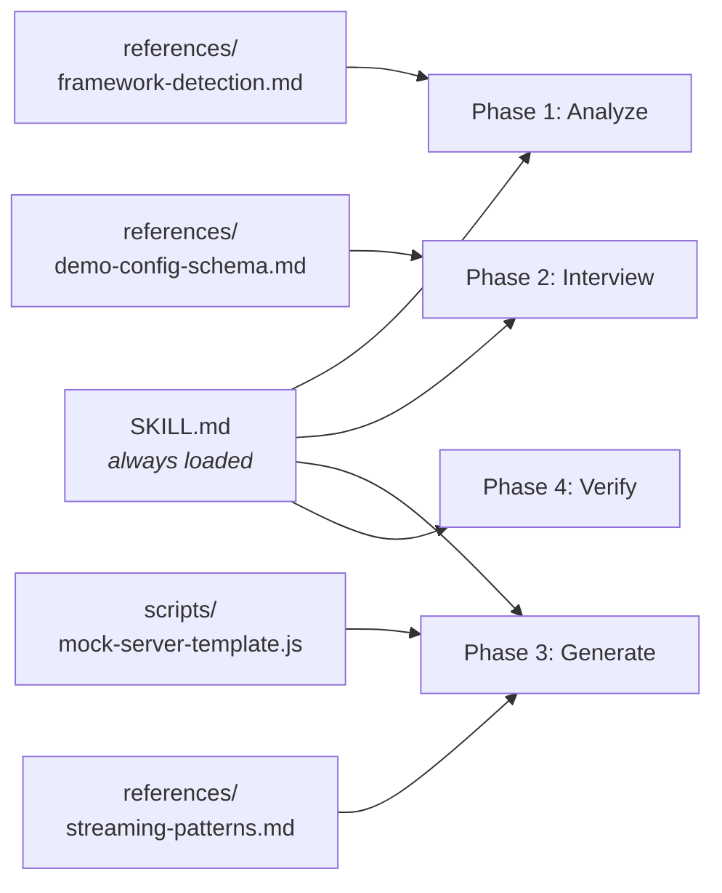
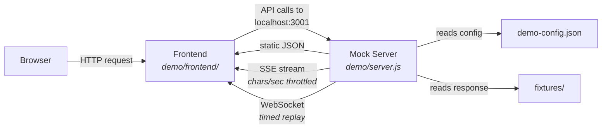

# CLAUDE.md

This file provides guidance to Claude Code (claude.ai/code) when working with code in this repository.

## What This Is

A Claude Code skill (`frontend-demo`) that generates standalone demo environments for hackathon projects. It creates a `demo/` folder with a mock Express server that replays pre-baked API responses (including realistic LLM streaming) so demos run flawlessly without real API calls.

## Repository Structure

This is a **documentation-driven skill** — no build step, no compilation. The skill uses progressive disclosure, loading reference files only when their phase is reached:

- `evals/evals.json` — 3 test cases (Next.js+OpenAI, Vue+REST, SvelteKit+Anthropic+WebSocket)

## Generated Demo Runtime

How the generated `demo/` folder works at runtime:

The `.env` in `demo/` redirects the frontend's API base URL from the real backend to `localhost:3001`. The mock server matches requests to demo steps sequentially and serves the corresponding fixture.

## Key Architecture Decisions

- **Config-driven**: The generated mock server reads `demo-config.json` at startup; all behavior (routes, fixtures, timing) is driven by config, not hardcoded logic.
- **The mock server template (`scripts/mock-server-template.js`) is copied verbatim** into generated `demo/` folders — customize via config, not by editing the template for individual demos.
- **Three response types**: static JSON, streaming SSE (with OpenAI/Anthropic format support), and WebSocket message replay.
- **Streaming speed is in chars/sec**: 25-35 is natural reading pace, 15-20 is dramatic, 40-60 is fast.
- **Debug endpoints**: `POST /__demo/reset` (reset step counter) and `GET /__demo/status` (current step info) are built into the mock server.

## No Build/Test/Lint Commands

This skill has no package.json, no dependencies, and no build process. The generated `demo/` folders have their own package.json using `express`, `cors`, `concurrently`, and optionally `ws`.

To run evals: use the test cases in `evals/evals.json` which define input scenarios and expected assertions.

## When Editing

- Changes to `SKILL.md` affect the core workflow all users see — the 4-phase process (Analyze → Interview → Generate → Verify).
- Changes to `scripts/mock-server-template.js` affect every generated mock server.
- Changes to `references/*.md` affect detection/generation accuracy for specific frameworks or streaming formats.
- Fixture file conventions: `step-{id}-stream.txt` (streaming), `step-{id}-response.json` (static), `step-{id}-messages.json` (WebSocket).
